## Since before

Since the previous article, I have implemented a lot of graphics techniques and expanded it functionality. From being able
to load `.glTF` file for more complicated scenes (with triangle clipping), to LTC area light, PBR shading and transmissive materials. It allowed me to render cool scenes
made by cool artists like `The Junk Shop`:

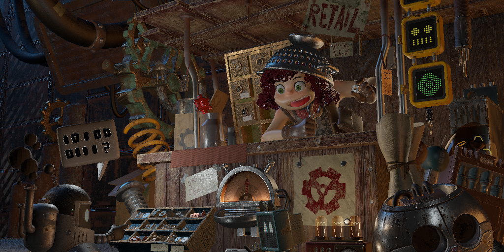

and modern sample assets such as `Lumberyard Bistro`:

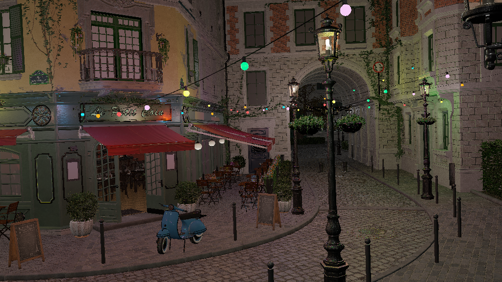

ensuring HDR screens are not wasted:


> Make sure your browser supports `.avif` file, or your screen supports HDR content

I haven't written much for it, other than simple [project page](zigcpurasterizer.html) as part of portflio. The reason for that is simple:

- There wasn't anything worth documenting that wouldn't be found by simple google search or something that people haven't already wrote 1000s of words about it.

As I am satisfied with the visual quality I have achieved for a CPU software rasterizer, I want to chase performance, hoping to getting in range of real-time (~50ms) rendering for midly complex scene. This is what blogpost are going to be about from now on.

## Frustum Culling

One of the biggest performance issue in computer graphics is doing computation on things that isn't going to show up on screen. We want to reduce them as much as possible. These computations in this case is triangle clipping. Right now, rasterizer do clipping test on *every single* triangle, including all the triangles of the mesh that is either completely inside/outside the view frustum. With frustum culling, we immediately reject mesh outside the frustum, and only perform clipping test on meshes lying on planes.

---

Lets first take a look at the theory behind frustrum culling, then we will look at pseudocode and finally at benchmark of the implementation.

In a standard graphics pipeline, clip-space is defined by the View-Projection (VP) matrix. A point `Pc` is inside the visible volume if:

```md
 -w_c <= x_c/y_c/z_c <= w_c,
 	where Pc = (x_c, y_c, z_c, w_c) is a point in clip-space
```

This volume is bounded by six planes. To cull objects efficiently, we need to extract these planes directly from our transformation matrix. These planes are:

```md
-> -w_c <= x_c  = Left Plane
->  x_c <= w_c  = Right Plane
-> -w_c <= y_c  = Top Plane
->  y_c <= w_c  = Bottom Plane
-> -w_c <= z_c  = Near Plane
->  z_c <= w_c  = Far Plane
```

If we re-arrange them, we get:

```md
-> w_c + x_c >= 0  = Left Plane
-> w_c - x_c >= 0  = Right Plane
-> w_c + y_c >= 0  = Top Plane              (EQ-0)
-> w_c - y_c >= 0  = Bottom Plane
-> w_c + z_c >= 0  = Near Plane
-> w_c - z_c >= 0  = Far Plane
```

Now, consider matrix multiplication of `VP` matrix and a world space point `P` to get clip-space point `Pc`:

```md
-> Pc = VP • P
```

Let represent VP matrix by rows:

```md
->
     | Row0 |
Pc = | Row1 | • P , where RowN represent each row of VP matrix
     | Row2 |
     | Row3 |

```

Results in:

```md
-> x_c = Row0 • P
-> y_c = Row1 • P            (EQ-1)
-> z_c = Row2 • P
-> w_c = Row3 • P
```

Substituting `EQ-1` in `EQ-0`, we get:

```md
-> (Row3 • P) + (Row0 • P) >= 0  = Left Plane
-> (Row3 • P) - (Row0 • P) >= 0  = Right Plane
-> (Row3 • P) + (Row1 • P) >= 0  = Top Plane
-> (Row3 • P) - (Row1 • P) >= 0  = Bottom Plane
-> (Row3 • P) + (Row2 • P) >= 0  = Near Plane
-> (Row3 • P) - (Row2 • P) >= 0  = Far Plane
```

Re-arranging them:

```md
-> (Row3 + Row0) • P >= 0  = Left Plane
-> (Row3 - Row0) • P >= 0  = Right Plane
-> (Row3 + Row1) • P >= 0  = Top Plane
-> (Row3 - Row1) • P >= 0  = Bottom Plane
-> (Row3 + Row2) • P >= 0  = Near Plane
-> (Row3 - Row2) • P >= 0  = Far Plane
```

Looks similar? It vector equation for each plane. Consider `Left Plane`, let expand `Row3` and `Row0`:

```txt
-> Row0 = (VP_00, VP_01, VP_02, VP_03)
-> Row3 = (VP_30, VP_31, VP_32, VP_33)

-> Row3 + Row0 = (VP_30 + VP_00, VP_31 + VP_01, VP_32 + VP_02, VP_33 + VP_03)
```

Lets rename each components:

```txt
-> A = VP_30 + VP_00
-> B = VP_31 + VP_01
-> C = VP_32 + VP_02
-> D = VP_33 + VP_03
```

If we do dot product of `(Row3 + Row0) = (A, B, C, D)` with `P = (x, y, z, 1)` we get:

```txt
Ax + By + Cz + D >= 0
```

Which is general equation of plane. A, B, C would represent normal and D the distance from origin.

Pseudocode would look like:

```py
def extractPlanes(view_projection_matrix):
	row0 = view_projection_matrix.row0()
	row1 = view_projection_matrix.row1()
	row2 = view_projection_matrix.row2()
	row3 = view_projection_matrix.row3()
	
	planes = [
		Vec4.add(row3, row0), # Left Plane
		Vec4.sub(row3, row0), # Right Plane
		Vec4.add(row3, row1), # Top Plane
		Vec4.sub(row3, row1), # Bottom Plane
		Vec4.add(row3, row2), # Near Plane
		Vec4.sub(row3, row2)  # Far Plane
	]
	
	for plane in planes:
		mag = sqrt(plane.x * plane.x + plane.y * plane.y + plane.z * plane.z)
		plane.x /= mag
		plane.y /= mag
		plane.z /= mag
		plane.w /= mag
	
	return planes
```

### Bounding Structures

There are multiple kind of bounding structures:

- Bounding Sphere
- Axis-Aligned Bounding Box (AABB)
- Oriented Bounding Box (OBB)
- Convex Hull

Among the fastest is Bounding Sphere and then AABB, but among the best bounded is OBB and Convex Hull. Each of them have their own use. For rasterizer need, we want to be able to quickly discard the object if it entirely out of frustum, and since our rasterizer has software triangle clipping (which can be a bottleneck) we want to do clipping only on objects intersecting the plane. So, we want the culling test to be fast with structure compact enough to minimize triangle clipping. Bounding Sphere and AABB are probably good enough for it.

To test sphere and plane intersection, we plug sphere's center into plane equation (sphere represented with center `S = (Sx, Sy, Sz)` and radius `R`):

```txt
ASx + BSy + CSz + D = 0
```

For each plane, we get three cases:

```txt
->       ASx + BSy + CSz + D  >  R  , completely inside the plane
->       ASx + BSy + CSz + D  < -R  , completely outside the plane
->  R <= ASx + BSy + CSz + D <= -R  , intersecting the plane
```

Psuedocode would look something like:

```py

def testBoundingSphere(planes, sphere):
	count = 0
	for plane in planes:
		n = plane.vec3()
		d = plane.w
		distance = Vec3.dot(n, sphere.center) + d
		
		if distance < -sphere.radius:
			return "Outside"
		if distance > sphere.radius:
			count += 1
	
	if count == 6:
		return "Inside"
	else:
		return "On-plane"
```

Culling test for AABB isn't much more complicated, though it little bit more computationally expensive. AABB can be represent in multiple ways, we represent it as Center `C` + Extent `E` (size). This way we can get each point and only store 6 floats. Test is straight forward, check if each point is "inside" the plane.

Example for one of the point if it completely inside:

```txt
-> x = Cx + Ex
-> y = Cy + Ey
-> z = Cz + Ez

-> P = (x, y, z)

-> (n • P) + d <= 0
```

In pseudocode it translate to:

```py
def testAABB(planes, aabb):
	plane_count = 0
	for plane in planes:
		count = 0
		n = plane.vec3()
		d = plane.w
		
		p = Vec3(aabb.c.x + aabb.e.x, aabb.c.y + aabb.e.y, aabb.c.z + aabb.e.z)
		if(Vec3.dot(n, p) + d > 0):
			count++
		p = Vec3(aabb.c.x - aabb.e.x, aabb.c.y + aabb.e.y, aabb.c.z + aabb.e.z)
		if(Vec3.dot(n, p) + d > 0):
			count++
		p = Vec3(aabb.c.x + aabb.e.x, aabb.c.y - aabb.e.y, aabb.c.z + aabb.e.z)
		if(Vec3.dot(n, p) + d > 0):
			count++
		p = Vec3(aabb.c.x + aabb.e.x, aabb.c.y + aabb.e.y, aabb.c.z - aabb.e.z)
		if(Vec3.dot(n, p) + d > 0):
			count++
		p = Vec3(aabb.c.x - aabb.e.x, aabb.c.y - aabb.e.y, aabb.c.z + aabb.e.z)
		if(Vec3.dot(n, p) + d > 0):
			count++
		p = Vec3(aabb.c.x + aabb.e.x, aabb.c.y - aabb.e.y, aabb.c.z - aabb.e.z)
		if(Vec3.dot(n, p) + d > 0):
			count++
		p = Vec3(aabb.c.x - aabb.e.x, aabb.c.y + aabb.e.y, aabb.c.z - aabb.e.z)
		if(Vec3.dot(n, p) + d > 0):
			count++
		p = Vec3(aabb.c.x - aabb.e.x, aabb.c.y - aabb.e.y, aabb.c.z - aabb.e.z)
		if(Vec3.dot(n, p) + d > 0):
			count++
		
		if(count == 0):
			return "Outside"
		if(count == 8):
			plane_count++
	
	if(plane_count == 6):
		return "Inside"
	else:
		return "On-plane"
```

Computationally, the AABB test is more expensive but if it culls better than sphere, better enough to reduce more pressure on culling test compared to sphere, than AABB should be faster. 

### Implementation

Here we have total object count, and "on-plane" object count for each bounding structure. Lower "on-plane" object count is better.

| Scene-Camera | Total | Sphere (on-plane) | Sphere % (on-plane) | AABB (on-plane) | AABB % (on-plane) |
|:-------------|------:|------------------:|--------------------:|----------------:|------------------:|
| JunkShop-1   |    78 |     58 | 74.36 % |  50 |  64.1 % |
| JunkShop-2   |    78 |     48 | 61.54 % |  36 | 46.15 % |
|   ‎          |   ‎   |   ‎    |   ‎     |  ‎  |    ‎    |
| Bistro-1     |  2909 |    176 |  6.05 % | 144 |  4.95 % |
| Bistro-2     |  2909 |    258 |  8.87 % | 188 |  6.46 % |
| Bistro-3     |  2909 |    268 |  9.21 % | 196 |  6.74 % |
| Bistro-4     |  2909 |    210 |  7.22 % | 150 |  5.16 % |
| Bistro-5     |  2909 |    157 |   5.4 % | 108 |  3.71 % |
|   ‎          |   ‎   |   ‎    |   ‎     |  ‎  |    ‎    |
| Tavern-1     |    69 |     62 | 89.86 % |  62 | 89.86 % |
| Tavern-2     |    69 |     66 | 95.65 % |  62 | 89.86 % |

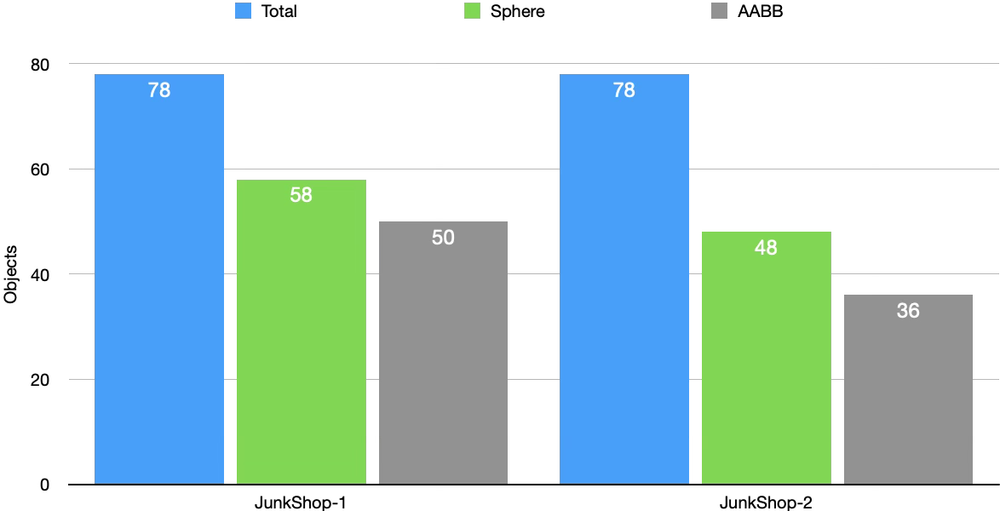
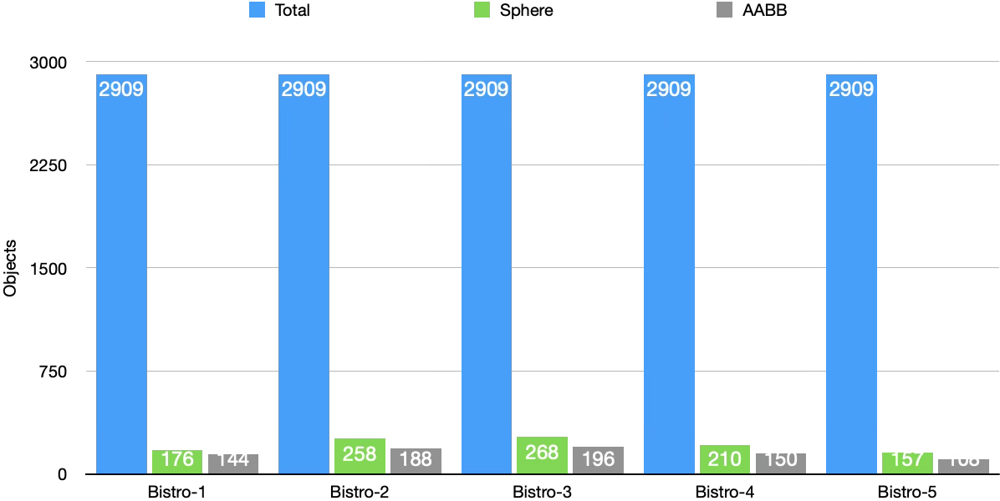
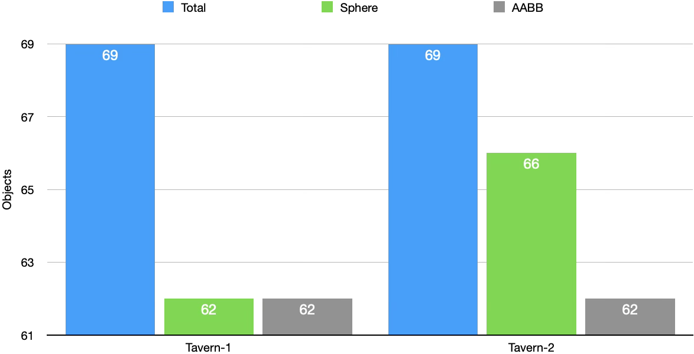

We can see AABB consistently perform better than sphere when it culling as accurately as possible and leaving less objects on plane for triangle clipping. This must mean we can also expect timing to be better for AABB, right?

#### Bistro Timings

Lets take a look at Bistro scene, it's sample asset that is large enough to make difference with frustum culling. We have timings with Bounding Sphere:

| Scene-Camera | Before (ms) | Sphere (ms) |	Diff (ms)	|     SE Diff (ms) |	Improvement (%) |
|:-------------|------------:|------------:|-----------:|-----------------:|-----------------:|
| Bistro-1     |        2126 |        1894 |        232 |             4.56 |          10.91 % |
| Bistro-2     |        2237 |        2001 |        236 |              5.9 |          10.55 % |
| Bistro-3     |        2138 |        1911 |        227 |             6.31 |          10.62 % |
| Bistro-4     |        2880 |        2580 |        300 |             7.95 |          10.42 % |
| Bistro-5     |        2554 |        2274 |        280 |             6.12 |          10.96 % |

The difference between before and after sphere frustum culling is loud and clear, with improvement consistently around ~10.5%. The timing is well above its standard error of difference `SE Diff` so we know improvement isn't noise.

Now lets see AABB frustum culling performance:

| Scene-Camera | Before (ms) | AABB (ms) | Diff (ms) |     SE Diff (ms) | Improvement (%) |
|:-------------|------------:|----------:|----------:|-----------------:|----------------:|
| Bistro-1     |        2126 |      1911 |       215 |             2.87 |           10.11 |
| Bistro-2     |        2237 |      1989 |       248 |             4.33 |           11.09 |
| Bistro-3     |        2138 |      1907 |       231 |             6.15 |            10.8 |
| Bistro-4     |        2880 |      2632 |       248 |              2.6 |            8.61 |
| Bistro-5     |        2554 |      2283 |       271 |             2.36 |           10.61 |

We can say the same here, performance improved upto 11.09%.

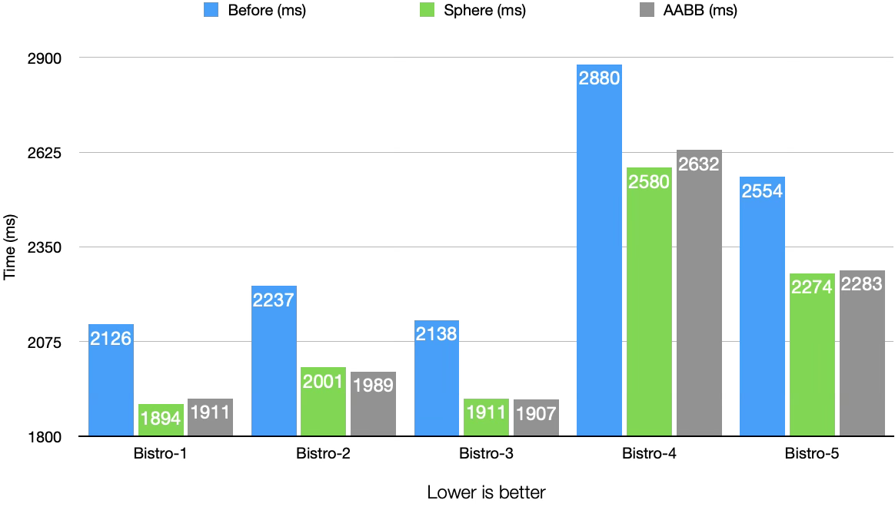

Now lets compare, both method and see which is actually better.

- `Bistro-4`: Sphere (2580 ms) beats AABB (2632 ms), their difference (52 ms) is well above their SE Diff (7.95 ms and 2.6 ms).
- `Bistro-1`: Sphere (1894 ms) beats AABB (1911 ms), their difference (17 ms) is above their SE Diff (4.56 ms and 2.87 ms).
- `Bistro-5`: Sphere (2274 ms) barely beats AABB (2283 ms), their difference (9 ms) is slightly above their SE Diff (6.12 ms and 2.36 ms).
- `Bistro-2`: AABB (1989 ms) beats Sphere (2001 ms), their difference (12 ms) is above their SE Diff (4.33 ms and 5.9 ms).
- `Bistro-3`: Its a tie between AABB (1907 ms) and Sphere (1911 ms), their difference (4 ms) is lower their SE Diff (6.15 ms and 6.31 ms).

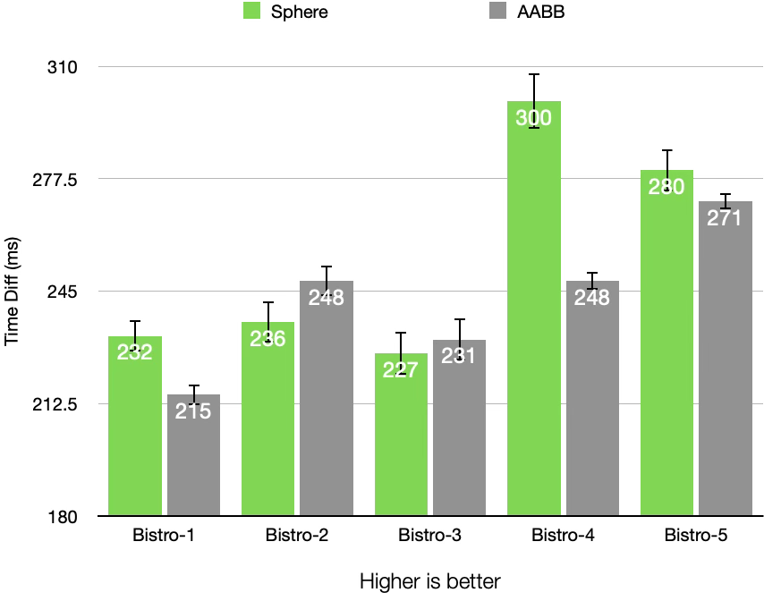

From what we see above, Sphere frustum culling appears to be somewhat better than AABB. Only in `Bistro-2` AABB win with some difference, while in `Bistro-3` AABB win is within margins of error.

#### The Junk Shop Timings

Sphere frustum culling timings:

| Scene-Camera | Before (ms) | Sphere (ms) | Diff (ms) | SE Diff (ms) | Improvement (%) |
|:-------------|------------:|------------:|----------:|-------------:|----------------:|
| JunkShop-1   |        2458 |        2263 |       195 |         4.72 |            7.93 |
| JunkShop-2   |        2016 |        1814 |       202 |         5.72 |           10.02 |

AABB frustum culling timings:

| Scene-Camera | Before (ms) | AABB (ms) | Diff (ms) | SE Diff (ms) | Improvement (%) |
|:-------------|------------:|----------:|----------:|-------------:|----------------:|
| JunkShop-1   |	      2458 |      2275 |       183 |          7.6 |	           7.45 |
| JunkShop-2   |	      2016 |      1810 |       206 |         5.23 |	          10.22 |

Even though the object culling count isn't as stellar as `Bistro` scene, rejection of fewer but higher poly mesh has contributed to higher improvement.

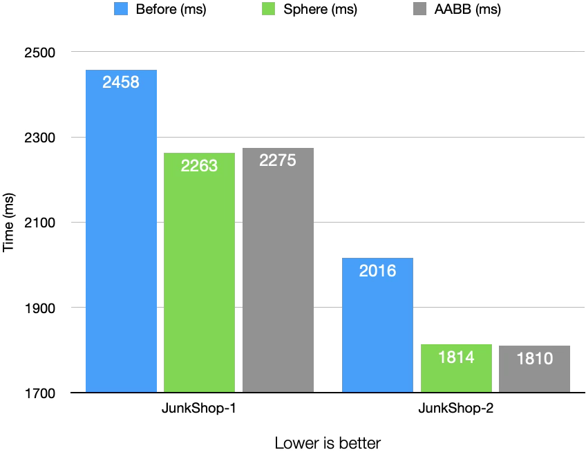

If we compare both methods, we can see:

- `JunkShop-1`: Sphere (2263 ms) beats AABB (2275 ms), their difference (12 ms) is above their SE Diff (4.72 ms and 7.6 ms).
- `JunkShop-2`: Its a tie between AABB (1810 ms) and Sphere (1814 ms), their difference (4 ms) is below their SE Diff (5.23 ms and 5.72 ms).

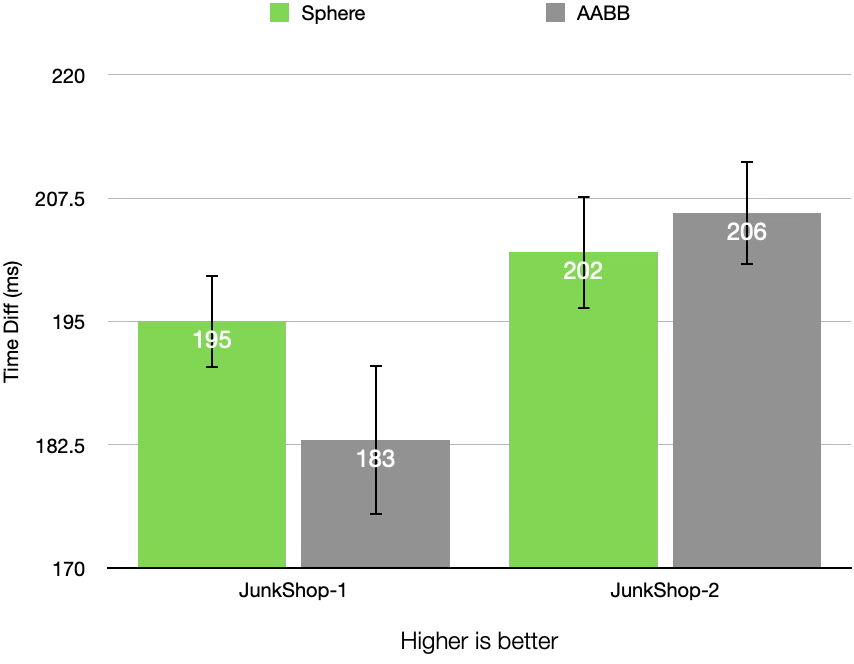

Sphere culling again appears to be slightly better than AABB.

#### Tavern Timings

Sphere frustum culling timings:

| Scene-Camera | Before (ms) | Sphere (ms) | Diff (ms) | SE Diff (ms) | Improvement (%) |
|:-------------|------------:|------------:|----------:|-------------:|----------------:|
| Tavern-1     |         588 |         579 |         9 |         2.09 |            1.53 |
| Tavern-2     |         681 |         677 |         4 |         2.14 |            0.59 |

AABB frustum culling timings:

| Scene-Camera | Before (ms) | AABB (ms) | Diff (ms) | SE Diff (ms) | Improvement (%) |
|:-------------|------------:|----------:|----------:|-------------:|----------------:|
| Tavern-1     |         588 |       575 |        13 |          2.1 |            2.21 |
| Tavern-2     |         681 |       668 |        13 |         1.88 |            1.91 |

Although very small, there is real improvement in speed.

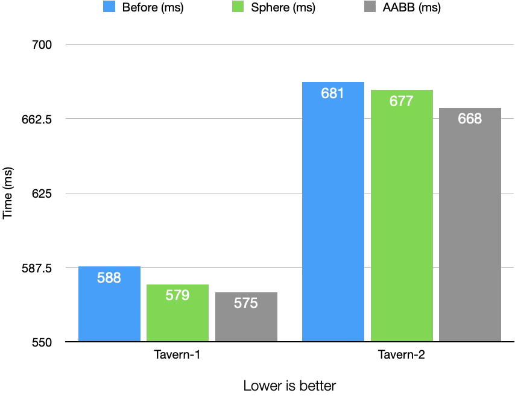

In both of the camera, AABB wins against Sphere:

- `Tavern-1`: AABB (575 ms) beats Sphere (579 ms), their difference (4 ms) is above then their SE Diff (2.09, 2.1).
- `Tavern-1`: AABB (668 ms) beats Sphere (677 ms), their difference (9 ms) is above then their SE Diff (2.14, 1.88).

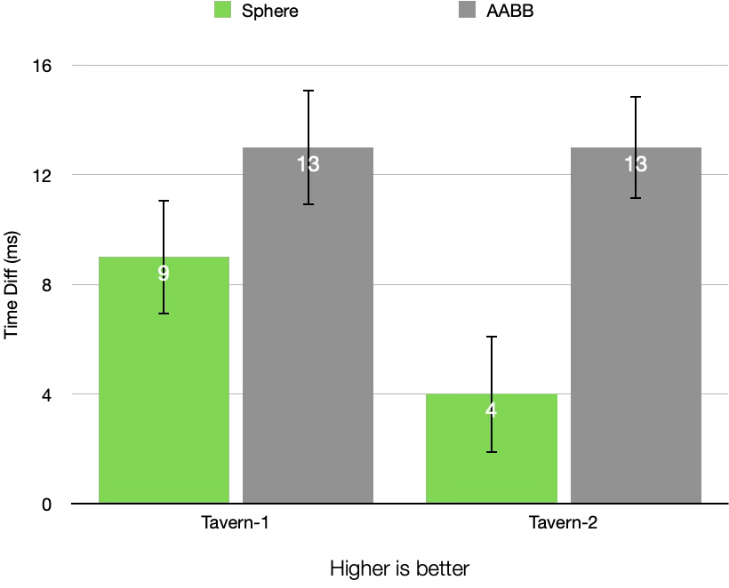

## Conclusion

Frustrum culling was the first step in improving the performance of a renderer, a step toward a hopeful real-time CPU rasterizer. 

What surprising was the close fight between Sphere and AABB culling, with Sphere winning by a metre. Perhaps a more complicated and larger scene might change that? Also, since it follows glTF file and structure format, all the meshes are divided by materials, which might not be most efficient way to part meshes into most equal volumes. Lastly, there no hierarchical structure so, some desired milliseconds might be left out.

## Read Also

- [View frustum culling - Mark Morley](http://www.racer.nl/reference/vfc_markmorley.htm)
- [Libretexts - Mathematics](https://math.libretexts.org/Bookshelves/Calculus/Calculus_(OpenStax)/12%3A_Vectors_in_Space/12.05%3A_Equations_of_Lines_and_Planes_in_Space)
