## Introduction

[ZigCPURasterizer](https://github.com/BlackGoku36/ZigCPURasterizer) is a CPU software rasterizer written in Zig. I initially wrote it to study how a rasterizer work, and how GPU process input geometry into an image, and inner working of graphics pipeline from start to finish. It was later pushed to handle loading glTF scenes with textures and PBR lighitng.

To maximise learning, but minimize distraction, aside from these libraries everything else is written from scratch:

- [sokol](https://github.com/floooh/sokol): Display rendered image in a window.
- [zgltf](https://github.com/kooparse/zgltf/tree/main): Parser for `.gltf` files
- [zigimg](https://github.com/zigimg/zigimg): Library for reading/writing `.png` files.

## Forward Renderer

The project is 2-pass forward renderer. The first is an opaque pass, where all opaques geometries are rendered with full shading. The second is translucent pass, all translucent triangles are sorted back-to-front and rendered with alpha transparency and crude screen-space refraction. Two pass are added together to form final pass and then displayed on screen.

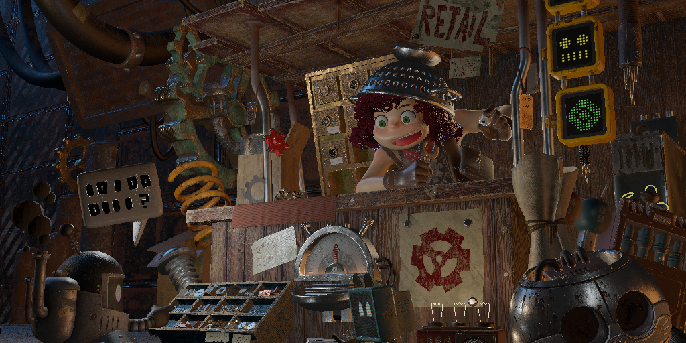
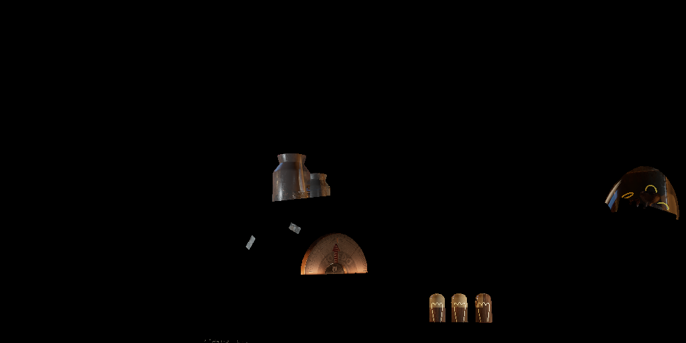

## PBR Shading

Industry standard PBR shading model is implemented:

- BRDF: Cook-Torrence BRDF
- NDF: Trowbridge-Reitz GGX model
- Geometry Function: Smith's Schlick-GGX approximation
- Fresnel: Fresnel-Schlick approximation

It uses glTF's metallic-roughness workflow for PBR texturing.

## Multiple Lights

Multiple lighting of different types is implemented:

- Directional / Sun Light
- Point Light
- Area Light: LTC Area Light from [Real-Time Polygonal-Light Shading with Linearly Transformed Cosines](https://eheitzresearch.wordpress.com/415-2/).

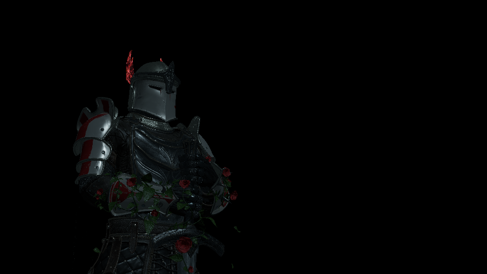

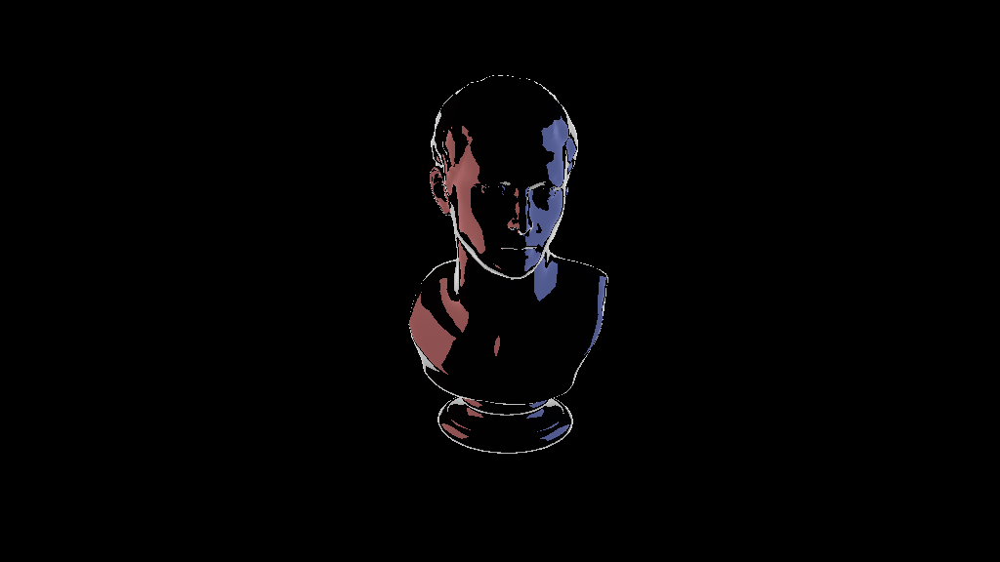

## Transmission Shading

Implementation is based on order-dependent transparency (sorted). Two framebuffers are used:

- **Opaque**: Only meshes with opaque materials are rendered.
- **Translucent**: Meshes with alpha-blending or transmission materials are rendered here. During this pass, the `Opaque`
framebuffer is sampled as "background color" to create refraction effect. Triangles in this pass are first sorted back-to-front.

Both pass are composited before being displayed in the window.

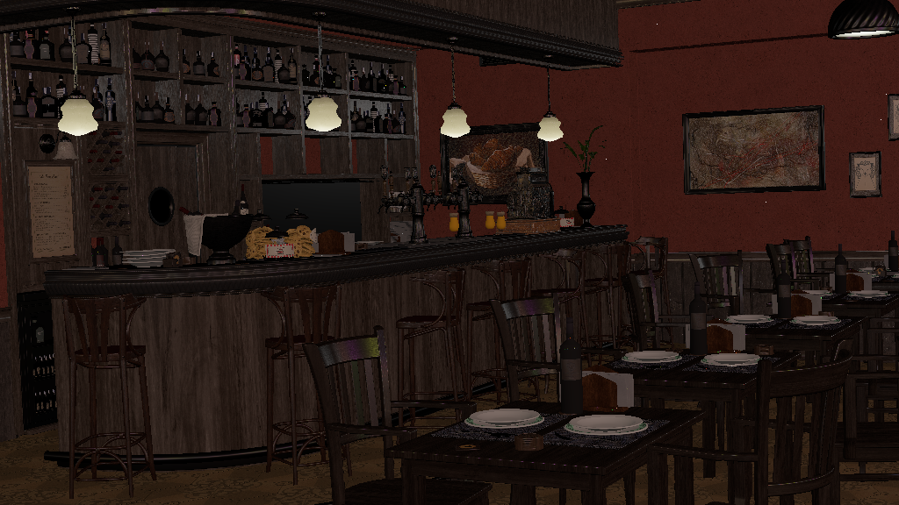
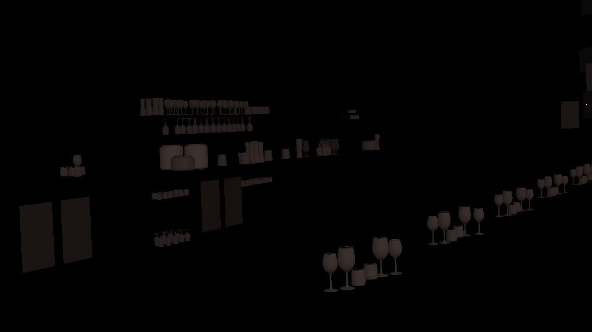
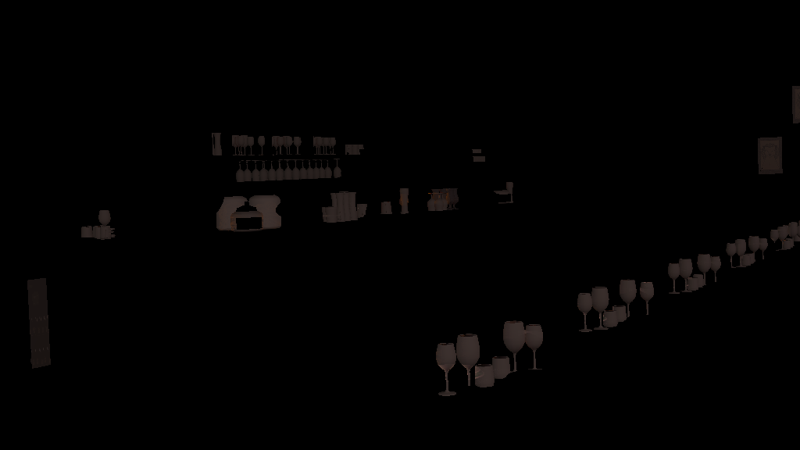
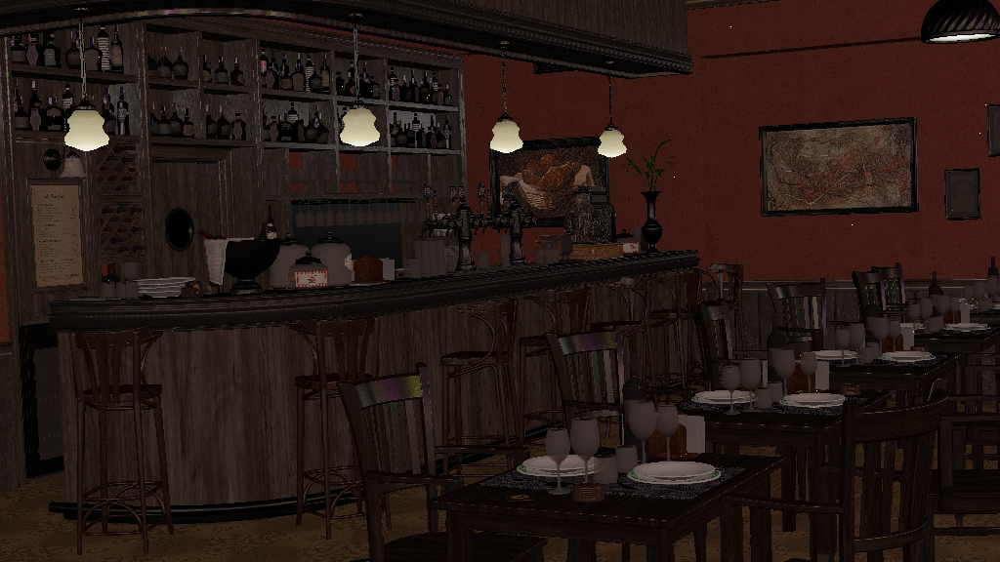

1. Opaque pass.
2. Translucent pass without sampling `Opaque` pass.
3. Translucent pass with sampling `Opaque` pass (also results in depth-test against opaque objects).
4. Final composition.

## SDR/HDR

The renderer follows a simple color pipeline:

- Texture (Stored; sRGB): Textures used by glTF are in `sRGB` space by default.
- Texture (Loaded; Linear): Color Textures are converted to `linear` space; Normal maps to [-1, 1] space.
- Render (Linear): All rendering process is done in `linear` space.
- Export (sRGB):
	- SDR `.png`: Colors are tone-mapped (using a simple Reinhard operator) to `sRGB` space.
	- HDR `.hdr`: Colors are exported directly in linear space with no tone-mapping.

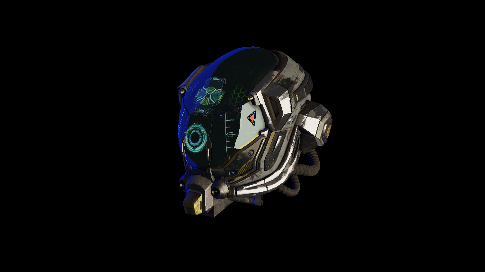

- **Left**: SDR `.png`
- **Right**: HDR `.avif` (converted from `.hdr` with ffmpeg). 

> If you can't see image on right, then maybe your browser doesn't support `.avif`. If colors are either off/muted or same
> as image on left, then maybe your monitor displays in SDR range.

## GLTF

Following `.gltf` file features are supported:

- Scenes
- Meshes
	- UVs
	- Tangents
	- Normals
- Images
	- color
	- metallic\_roughness
	- emissive
	- transmission
	- occlusion
- Materials
	- metallic\_roughness
	- emissive\_factor
	- transmission\_factor
	- ior
	- alpha\_mode
- Camera
- khr\_lights_punctual
- khr\_materials\_emissive_strength
- khr\_materials_ior
- khr\_materials_transmission

Because area lights aren't natively supported by glTF spec., a mesh with 4 vertices, name starting with `arealight_` and an emissive material is treated as area light. The light is pointed in direction of mesh's normal and is assumed to be single-sided.

Tangents and Normals are dynamically calculated from the mesh if they are missing from the `.gltf` files.

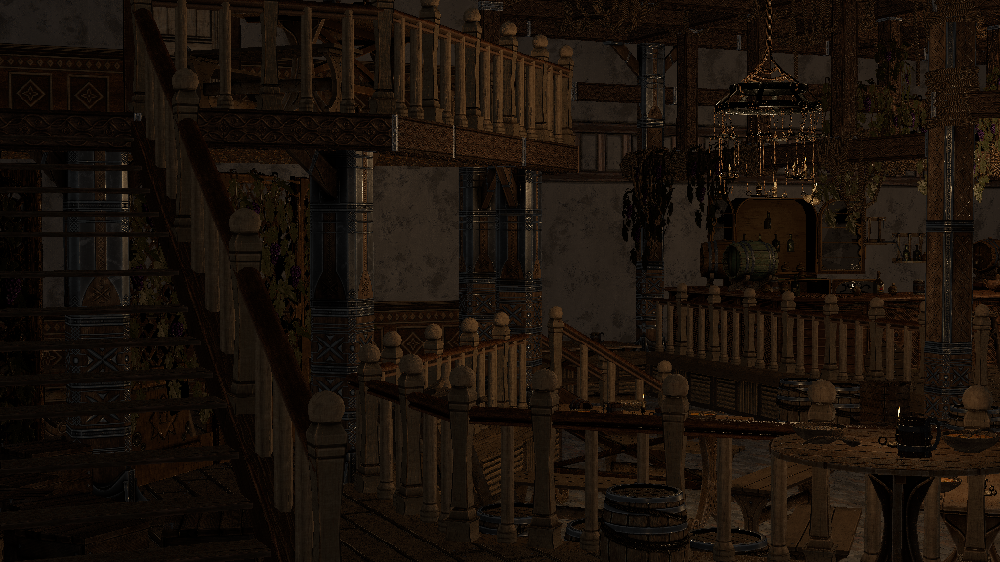
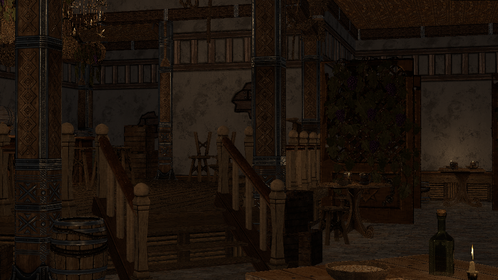

## Performance

Measurements taken on an M3 Pro (Single Threaded, 1024 x 576):

| Scene                          | Time (ms) |
|:-------------------------------|----------:|
| Lumberyard's Bistro (Exterior) | 14,103 ms |
| Lumberyard's Bistro (Interior) |  2,649 ms |
| Junk Shop                      |  2,493 ms |
| Tavern (cam 1)                 |    630 ms |
| Tavern (cam 2)                 |    732 ms |
| Knight                         |     49 ms |

Scene Statistics:

| Scene                          | Opaque Tris | Translucent Tris | Area Light | Point Light | Directional Light |
|:-------------------------------|------------:|-----------------:|-----------:|------------:|------------------:|
| Lumberyard's Bistro (Exterior) |    17,91,975|             1,507|          0 |           72|                 1 |
| Lumberyard's Bistro (Interior) |     4,53,134|            26,151|          0 |           72|                 1 |
| Junk Shop                      |    29,63,742|             7,196|         11 |           20|                 0 |
| Tavern (cam 1)                 |     1,21,980|              2408|          0 |           17|                 0 |
| Tavern (cam 2)                 |       88,617|              2625|          0 |           17|                 0 |
| Knight                         |     1,04,377|                 6|          0 |            0|                 1 |

## Future

Barely any optimization techniques are implemented. I want to push it as much as possible by implementing various graphics optimization techniques, before looking at tried-and-tested SIMD instructions and multi-threading.

I deliberately left out advanced graphical features (such as shadows, SSAO, IBL, and skeletal animation), to keep focus on
core software rasterization pipeline. Since I have already implemented them in other graphics API projects, I am satisfied with
visual quality so far achieved using just CPU.

## Related Articles

- [CPU Rasterizer From Scratch - Part 1](cpu-rasterizer-from-scratch-part1.html)
- [CPU Rasterizer From Scratch - Part 2](cpu-rasterizer-from-scratch-part2.html)
